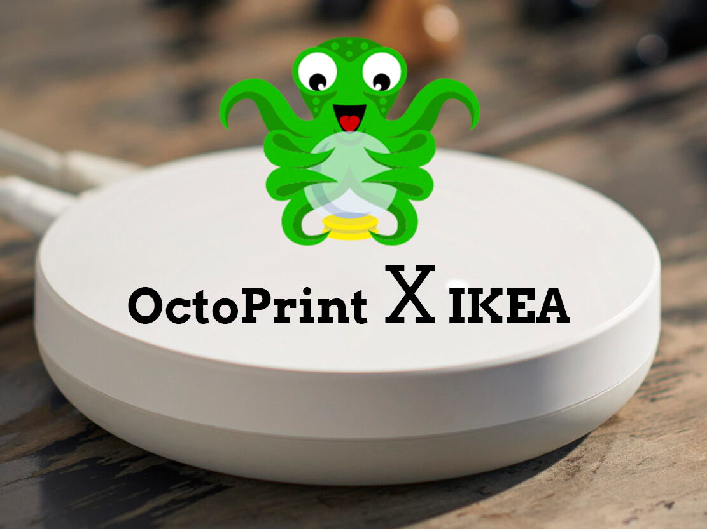

# OctoPrint Plugin PSU Control IKEA Dirigera

IKEA Dirigera subplugin for [PSU Control](https://github.com/kantlivelong/OctoPrint-PSUControl) in [Octoprint](https://octoprint.org/)

Add the ability to control any IKEA Smart outlet connected to IKEA Dirigera Hub, via the PSU Control Plugin.

- Choose this plugin for Switching and/or sensing in [PSU Control](https://github.com/kantlivelong/OctoPrint-PSUControl) Settings.
- Input Ikea Dirigera IP address, Outlet Name and generate a token and you are ready to go.

## Setup

Install via the bundled [Plugin Manager](https://docs.octoprint.org/en/master/bundledplugins/pluginmanager.html)
or manually using this URL:

    https://github.com/Mesterkaa/OctoPrint-Psu_control_ikea_dirigera/archive/master.zip

## Configuration

Follow the Step-To-Step guide in the Plugin settings.
1. **Enter Outlet Name**
    - The outlet name is the name given to the device in the IKEA "Home Smart" App.
        - [Apple](https://apps.apple.com/us/app/ikea-home-smart/id1633226273)
        - [Android](https://play.google.com/store/apps/details?id=com.ikea.inter.homesmart.system2)
    - The name needs to be unique and can be edited in the app.
2. **Enter IP Address**
    - IP Address of the IKEA Dirigera Hub. The app sadly doesn't show it so it has be found in other ways e.g. your router settings.
3. **Send Challenge**
    - Click the button and await a succes.
    - A **fail** will be followed by some error data that might give a hint of the error.
4. **Click Action Button**
    - On the buttom of the IKEA Dirigera device is a button label **Action**.
    - Click this on.
5. **Generate Token**
    - Click the button and await a succes.
    - A succesfull call will result in **token** in the "Generated Token" field.
    - A **fail** will be followed by some error data that might give a hint of the error.
6. **Test Connection (Optional)**
    - Optionally you can test the connection
    - On a succes you should see the current status of the outlet
7. **Remeber to Save**
    - The token has been fetched from the IKEA Dirigera but has yet to be saved.
    - **Remeber to save!!**

